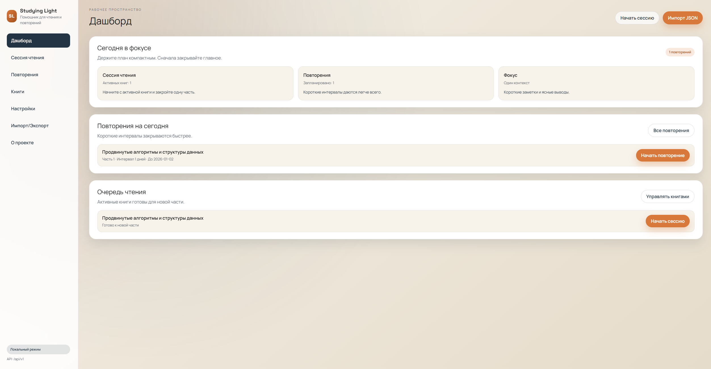

# Studying Light

Studying Light is a lightweight reading and review companion. Track books,
split them into parts, and schedule reviews so you keep what you read.



## Features

- Book and part tracking with review scheduling.
- Reading sessions with stats and a Pomodoro-style timer.
- CSV/ZIP export.
- Local-first SQLite storage with backups.
- FastAPI backend and a React frontend.

## Документация

- Архитектура: `docs/specs/architecture.md`
- Модель данных: `docs/specs/data-model.md`
- Правила повторений: `docs/specs/review-scheduling.md`
- Границы API: `docs/specs/api-boundaries.md`
- Хранение и бэкапы: `docs/database.md`

## Quickstart (Docker)

```bash
cp .env.example .env
```

Edit `.env` if needed, then:

```bash
docker compose --env-file .env up --build
```

Open `http://localhost:8000`.

## Quickstart (Local)

```bash
uv sync --extra dev
uv run alembic upgrade head
uv run uvicorn studying_light.main:app --reload
```

Open `http://localhost:8000`.

Optional frontend dev server:

```bash
cd frontend
npm install
npm run dev
```

## API (справка)

Интерактивная документация: `http://localhost:8000/docs`.

Базовый префикс: `/api/v1`.

Пример: создать книгу

```bash
curl -X POST http://localhost:8000/api/v1/books \
  -H "Content-Type: application/json" \
  -d '{"title":"Deep Work","author":"Cal Newport","pages_total":304}'
```

Ответ:

```json
{
  "id": 1,
  "title": "Deep Work",
  "author": "Cal Newport",
  "status": "active",
  "pages_total": 304,
  "pages_read_total": 0,
  "parts_total": 0,
  "sessions_total": 0,
  "reading_seconds_total": 0
}
```

Пример: план на сегодня

```bash
curl http://localhost:8000/api/v1/today
```

Ответ:

```json
{
  "active_books": [
    {
      "id": 1,
      "title": "Deep Work",
      "author": "Cal Newport",
      "status": "active",
      "pages_total": 304,
      "pages_read_total": 0
    }
  ],
  "review_items": [
    {
      "id": 10,
      "reading_part_id": 5,
      "interval_days": 7,
      "due_date": "2026-01-08",
      "status": "planned",
      "book_id": 1,
      "book_title": "Deep Work",
      "part_index": 2,
      "label": "Chapter 2"
    }
  ],
  "review_progress": {
    "total": 12,
    "completed": 4
  }
}
```

## Configuration

Defaults below are from `.env.example`.

| Variable  | Default            | Notes                                                        |
| --------- | ------------------ | ------------------------------------------------------------ |
| `APP_ENV` | `local`            | Environment label.                                           |
| `DB_PATH` | `/data/app.db`     | Docker default. If unset locally, defaults to `data/app.db`. |
| `TZ`      | `Europe/Amsterdam` | Container timezone.                                          |

Optional:

- `DATABASE_URL`: overrides `DB_PATH` when set.

## Project status

Status: beta (active development). Interfaces may change.

## Support

- Issues: use GitHub Issues for bugs and feature requests.
- Discussions: use GitHub Discussions for questions.
- Security: email `newerasowwor@gmail.com`.

## License

MIT. See `LICENSE`.
